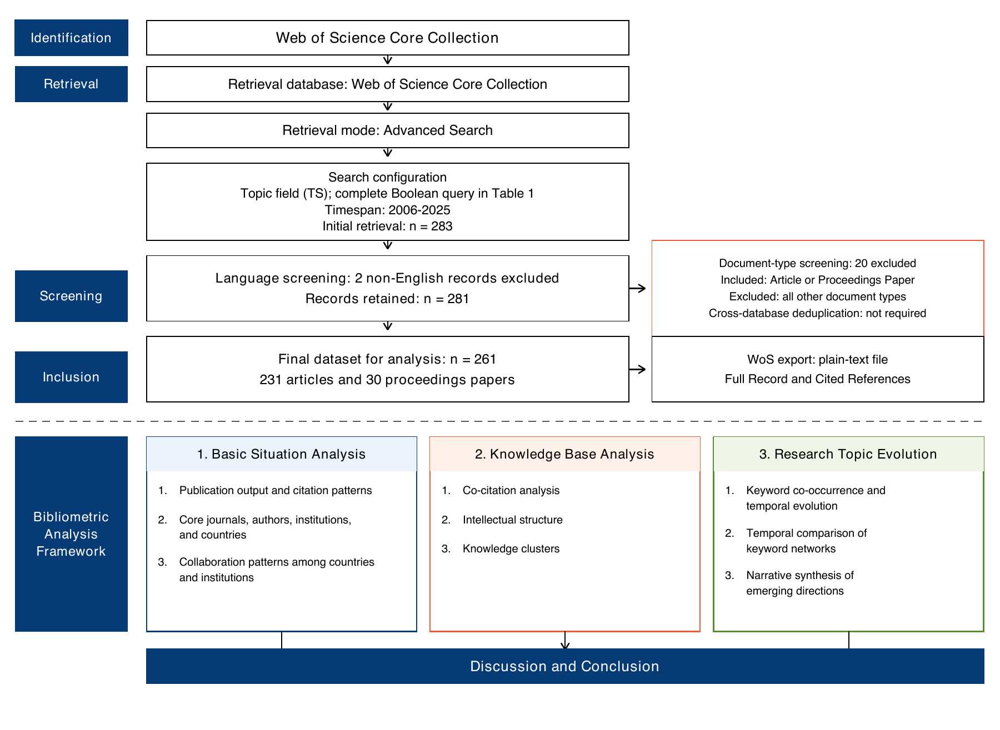
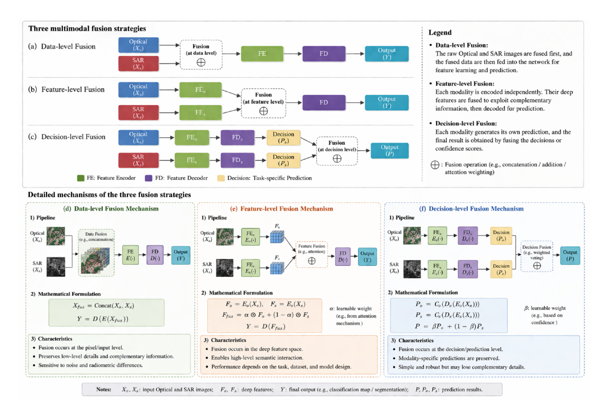

# Deep learning and multi-level fusion for LULC classification

This public companion repository contains the manuscript source and the available
reproducibility materials for:

> *Deep learning and multi-level fusion for land-use and land-cover
> classification: Technological evolution and future directions*

The repository separates the screened analysis input, derived software outputs,
method settings, manuscript files, and validation code.

## Study overview

The review combines a documented WoSCC search and screening process with
bibliometric analysis, keyword-network analysis, and a critical synthesis of
deep-learning-based fusion methods. The workflow below links the corpus definition
to the three analytical components and the final discussion.

[](manuscript/Figures/flowchart.pdf)

*Literature retrieval, screening, and review workflow. Select the image to open
the original PDF.*

Within the technical synthesis, data-level, feature-level, and decision-level
fusion are treated as alternative integration designs with different information
flows and failure modes, rather than as a compulsory sequence of technological
development.

[](manuscript/Figures/Fusion_Picture.pdf)

*Schematic comparison of the three principal fusion levels. Select the image to
open the original PDF.*

## Current status

The manuscript reports a final corpus of 261 publications retrieved from the Web
of Science Core Collection (WoSCC) for 2006–2025. The retained working materials
contain archived paper-level fusion assignments for 163 records:

- 131 feature-level only;
- 18 hybrid, comprising 12 data–feature and six feature–decision records;
- seven data-level only; and
- seven decision-level only.

The corpus count is reconciled at title level as the 255 publications in the
intermediate working sheet plus six eligible publications restored from seven
candidate omissions, giving `255 + 6 = 261`. The excluded candidate used fixed,
non-learned convolutional kernels and explicitly avoided network training, so it
did not meet the applied deep-learning scope. The record-level decisions are
listed in [`docs/coding_sheet_omissions.md`](docs/coding_sheet_omissions.md).
The resulting analytical membership is published as a limited-metadata
[`261-record CSV manifest`](data/processed/corpus/screened_corpus_261_manifest.csv),
with a machine-readable [`JSON counterpart`](data/processed/corpus/screened_corpus_261_manifest.json).
It contains 261 unique WoS accession numbers and reproduces the reported grouping
of 231 Articles and 30 Proceedings Papers.

The retained working materials contain 163 assignments from a separate,
second-stage fusion-content analysis associated with the 261-record bibliometric
corpus. An assignment was retained only when the abstract, keywords, dataset
information, and model description supported a reliable classification of an
explicit data-, feature-, decision-, or hybrid-level fusion operation. The other
98 records remained in the bibliometric corpus but are outside this archived
assigned subset: 92 are unassigned rows in the 255-title working sheet and six
are the restored bibliometric records for which no fusion category was created
retrospectively.

The record-level source for the 163 category assignments is available as
[`archived_fusion_coding_subset.xlsx`](data/processed/coding/archived_fusion_coding_subset.xlsx),
with a machine-readable JSON counterpart and a standard-library validation/build
script. The table includes UT, DOI, title, publication year, retained model,
dataset and fusion-method notes, original labels, standardised categories, and
operational basis codes. This is a criterion-defined analytical subset, not a
random sample. The table does not assign a fusion level to the other 98
bibliometric records, and its category totals are not presented as a fusion-level
distribution for the complete corpus.

The six restored bibliometric records were not assigned fusion categories
retrospectively. Accordingly, the 98 records outside the archived 163-record
fusion-level subset consist of the 92 blank rows in the intermediate sheet plus
these six restored records; the archived category totals remain unchanged.

The screened WoS tagged-text input is available as
[`wos_export_screened_261.txt`](data/raw/wos/wos_export_screened_261.txt). It was
created by retaining the 261 accession numbers in the analytical-corpus manifest
and removing five records that did not satisfy the period, language, or applied
deep-learning scope. The original archive is preserved locally and was not
overwritten.

## Repository structure

```text
manuscript/       Current LaTeX source and active figures
data/raw/         Screened 261-record WoS input and source documentation
data/interim/     Templates for future screening and reviewed coding
data/processed/   Supplied HistCite and VOSviewer outputs
config/           Search, coding, software, and VOSviewer documentation
code/             Validation utilities and future analysis scripts
docs/figures/     Figure provenance, reproduction manifest, and quality audit
docs/review/      Reviewer-response working documents
docs/             Audit findings, limitations, and reproducibility checklist
```

## Search strategy reported in the manuscript

- Database: Web of Science Core Collection
- Interface: Advanced Search
- Field: Topic (`TS`)
- Index coverage: the default WoSCC coverage available through the authors'
  institutional subscription; no individual citation index was manually selected
- Period: 2006–2025
- Language: English
- Document types: Article and Proceedings Paper
- Export: plain text, Full Record and Cited References
- Retrieval date: January 2026; approximately 10 January was recalled, but the
  exact day was not retained and is therefore not reported as certain

```text
TS=(("ensemble" OR "fusion") AND
    ("land use classification" OR "land cover classification" OR
     "land use recognition" OR "land cover recognition" OR
     "land use detection" OR "land cover detection") AND
    ("deep learning"))
```

The manuscript reports 283 initial records, followed by exclusion of two
non-English records and 20 records outside the eligible document types, yielding
the final corpus of 261 publications. The public tagged-text file and the
identifier/title manifest contain the same 261 unique WoS accession numbers. See
[`config/search_strategy.md`](config/search_strategy.md).

## Reproduction workflow

1. Validate the screened tagged-text file and freeze the corpus by Web of Science
   accession number (`UT`).
2. Record every further exclusion in `data/interim/screening_log_template.csv`.
3. Review or extend fusion-level coding using
   `data/interim/fusion_coding_reviewed_template.csv` and the documented protocol.
4. Use the archived thesauri and the visible VOSviewer settings in
   [`retained_network_settings.md`](config/vosviewer/retained_network_settings.md).
5. Link each manuscript figure to its input, software or script, settings, and
   output in [`docs/figures/figure_manifest.csv`](docs/figures/figure_manifest.csv).

The screened WoS tagged-text file can be validated without changing it:

```bash
python3 code/validate_wos_records.py data/raw/wos/wos_export_screened_261.txt
```

The public 261-record analytical manifest can also be checked independently:

```bash
python3 code/validate_screened_corpus_manifest.py
```

## Software information

VOSviewer 1.6.20 is confirmed from the supplied application information. Exact
versions of CiteSpace, HistCite, Bibliometrix, R, and Python used for the manuscript
analysis remain to be recorded in
[`config/software_versions.md`](config/software_versions.md).

## VOSviewer materials

The supplied keyword and author tables report item-level counts and total link
strength. Two cropped screenshots document only the visible normalisation,
layout, clustering, weighting, label, and line-display controls for the
represented keyword-map configuration. These visible controls are recorded in
[`retained_network_settings.md`](config/vosviewer/retained_network_settings.md).
The corresponding unedited screenshots are archived in
[`config/vosviewer/evidence`](config/vosviewer/evidence/).

The original thesauri are preserved verbatim. Some replacements merge related but
non-equivalent concepts (for example, `network` into `cnn`, or `multimodal fusion`
into `fusion`). Their use and limitations are documented in
[`keyword_cleaning_protocol.md`](config/vosviewer/keyword_cleaning_protocol.md).
No keyword frequencies were recomputed during revision.

For the keyword maps, the documented chain is: screened WoS tagged-text input →
VOSviewer co-occurrence analysis using *All keywords* → the corresponding public
thesaurus → the archived visible settings → exported network or
average-publication-year overlay. The 261-record input is identified by record
count and SHA-256 in
[`data/raw/private_source_manifest.csv`](data/raw/private_source_manifest.csv).

## Data access and licensing

The screened WoS export is included at the author's request. Users remain
responsible for complying with the terms attached to their own access to Web of
Science content. Licensing boundaries are documented in
[`docs/licensing.md`](docs/licensing.md); code is covered by the MIT `LICENSE`.

## Citation

Please cite the associated manuscript as:

> Cheng, J., Xie, J., Xia, S., & Frery, A. C. *Deep learning and multi-level
> fusion for land-use and land-cover classification: Technological evolution and
> future directions*. Manuscript under review at *International Journal of Remote
> Sensing*.

Machine-readable metadata are provided in [`CITATION.cff`](CITATION.cff).
Publication year, volume, issue, page range, and DOI are intentionally omitted
until the manuscript is accepted and the corresponding bibliographic information
is available.
